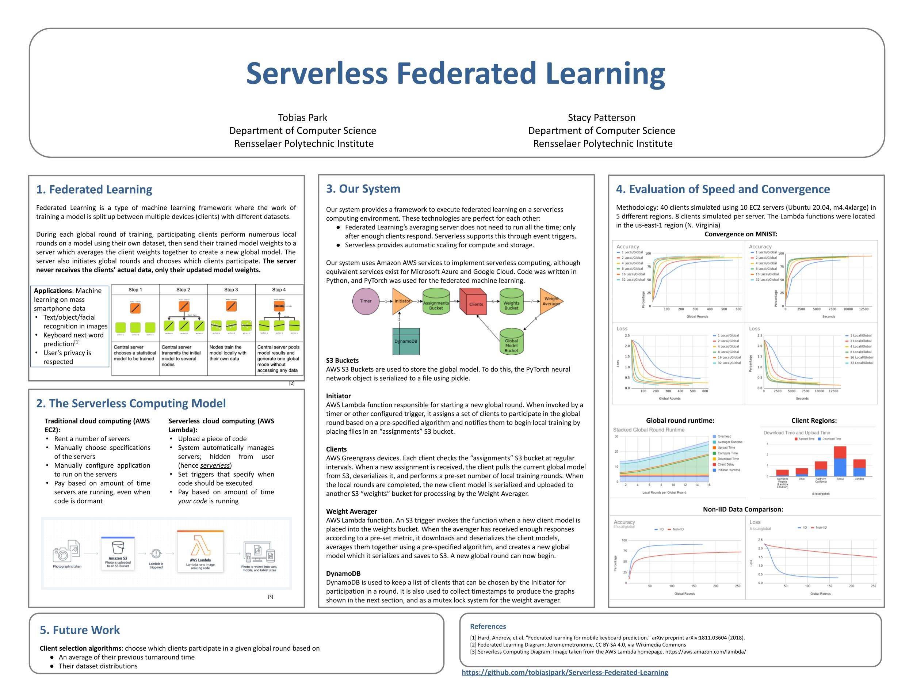

# Serverless Federated Learning
This is my computer science Master's Project to use federated learning to train machine learning models over edge devices and develop a federated learning framework using the serverless computing model on AWS Lambda/Greengrass.



# Documentation/Instructions
See [the wiki](https://github.com/tobiasjpark/Serverless-Federated-Learning/wiki).

# Folder Structure (see docs for more info)

```
root
└───initiator
│   │   
│   └───ChooseClients.py (customize how clients are selected)
│   └───lambda_function.py (main lambda function for initiating rounds)
│
└───client
│   │   
│   └───CreatePickle.py (customize how neural network data is serialized)
│   └───LoadData.py (customize how neural network data is loaded)
│   └───Net.py (customize the neural network architecture)
│   └───SleepTilNextRound.py (customize how clients wait for next round)
│   └───Train.py (customize how clients train the neural net)
│   └───client.py (main client runtime function)
│
└───utils
│   │   
│   └───create_empty_NN_file.py (script to create an empty neural network)
│   └───split_datasets.py (split a dataset into multiple parts for running experiments with multiple clients)
│
└───weight-averager
│   │   
│   └───averager
│   |   │   AverageModels.py (customize how client data is averaged together)
│   |   │   CheckThreshold.py (customize how to wait for clients to respond)
│   |   │   Net.py (customize the neural network architecture)
│   |   │   UpdateInitiatorTimer.py (customize how to dynamically update the initiator's timer)
│   |   │   app.py (main lambda function for averaging results)
```


Special thanks to my advisor Dr. Stacy Patterson, and to Timothy Castiglia for help with PyTorch.
